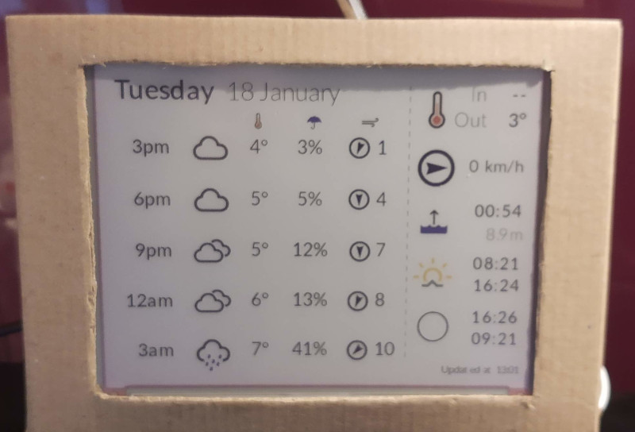

# Inky Info Display

This repo uses a template SVG to populate an information display for the [Pimoroni Inky Impression](https://pimoroni.com/impression).

This follows in the footsteps of [Andrew Godwin's weatherboard](https://github.com/andrewgodwin/weatherboard), using a slightly different approach. I was originally put on to Andrew's work through Matthew Somerville's [write up about it](https://dracos.co.uk/wrote/inky-dashboard/).



## Installation

This repo assumes you've the Pimoroni [Python library](https://github.com/pimoroni/inky) installed, with the example image setter in `$HOME/Pimoroni/inky/examples/7color/image.py`.

After that, a few bits of ruby are needed:

```
sudo apt install ruby ruby-bundler ruby-dev ruby-nokogiri fonts-lato
bundle install --path vendor/bundle
```

## Usage

This software is configured through environment variables.  There is a `.env.example` with the various settings in it.  You'll want some API keys for services from
* [Met Office](https://www.metoffice.gov.uk/services/data/datapoint/api)
* [Weather Underground](https://www.wunderground.com/member/api-keys)

and put these into the `.env`

### Configuring the weather forecast

For the weather forecast you'll want a Met Office location ID.  This is not the easiest to get hold of.

e.g. for Braintree (**NB** you'll need `jq` and `curl` installed here)
```
$ curl http://datapoint.metoffice.gov.uk/public/data/val/wxfcs/all/json/sitelist?key=API_KEY > sitelist.json
$ jq '.Locations.Location | map(select(.name | startswith("Braintree")))'  < sitelist.json
```
gives
```json
[
  {
    "elevation": "70.0",
    "id": "350563",
    "latitude": "51.8797",
    "longitude": "0.5526",
    "name": "Braintree",
    "region": "ee",
    "unitaryAuthArea": "Essex"
  }
]
```
so pick out the `id` of `350563` and put that in `DATAPOINT_LOCATION_ID`

### Configuring current conditions

I've decided to use [Weather Underground](https://www.wunderground.com/) to snarf data from local personal weather stations to give an idea of what it is outside nearby.  Just find your nearest weather station, and use its ID in your `.env`.  E.g. for [Dunoon](https://www.wunderground.com/dashboard/pws/IDUNOO13), you'd put in `IDUNOO13` is your `WUNDERGROUND_STATION_ID`.  Don't forget you need a `WUNDERGROUND_API_KEY` for this to work.

### Configuring the tide forecast

This uses the [Admiralty Easy Tide](https://easytide.admiralty.co.uk/).  Simply look up the port you want to use, and then pinch the ID from the URL.  E.g. for Maldon, Essex, it is `0123B`.  Put that into `EASYTIDE_PORT_ID`.

### Configuring the sun rise/set etc

For this you need to know your latitude / longitude.  There are any number of geocoding websites to use here.  The results need to be decimals (rather than degrees), e.g. for Colchester, Essex put `LATITUDE` as 0.898 and `LONGITUDE` as 51.881.

### Testing it all out

You should now be able to run `./bin/update-inky.sh`

## weather-icons

This are taken from [Erik Flowers's weather-icons](https://github.com/erikflowers/weather-icons).

I've converted them to have a 100px base size, up from 30px using `rsvg-convert`, so that when embedded in the output SVG no scaling is needed.

## Changing the layout

There are a couple of different SVG templates in this repo.  Basically the output is generated by matching elements in the SVG by id, and replacing the text content, or linking a different image.  This lends itself well to designing new displays by editing the SVG template in your [favourite SVG editor](https://inkscape.org/).

If you add in more items, or change existing ones make sure tha the `id` is set correctly.  In Inkscape I've found the easiest way to do this is selecting the object and then going to `Edit -> XML Editor` to show the element's attributes.

Example IDs are:
* `day` -> text here replaced with day, e.g. Monday
* `date` -> here replaced with the date, e.g. 12 January
and so on.

